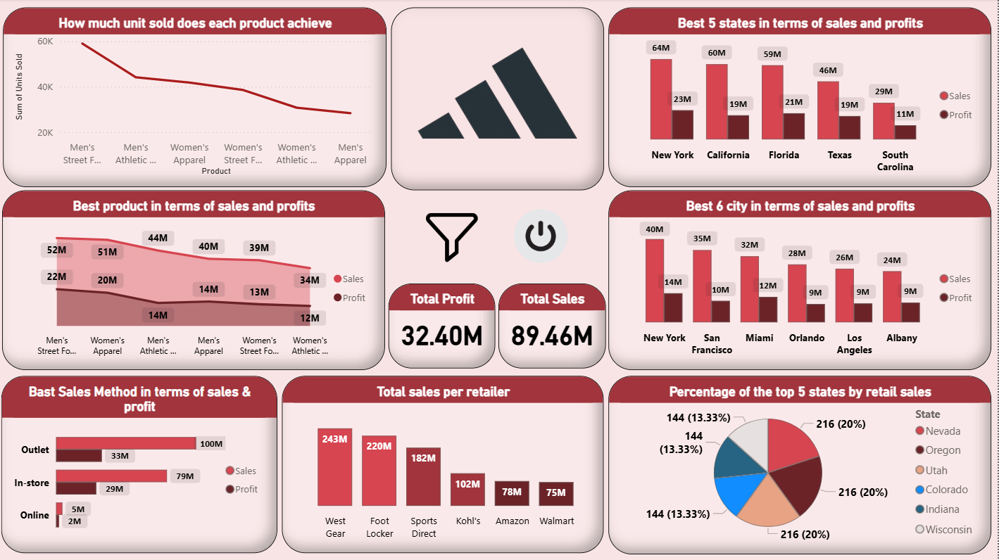

# Adidas
Adidas US Sales Dashboard
# Adidas Sales Dashboard  
تحليل مبيعات وأرباح Adidas في الولايات المتحدة

## نبذة عن المشروع

لوحة تحكم (Dashboard) تحليلية مبنية على بيانات مبيعات وأرباح منتجات **Adidas** في السوق الأمريكي.  
الهدف: اكتشاف أنماط المبيعات، أفضل المنتجات، أقوى الولايات والمدن، أداء قنوات البيع (Online / In-store / Outlet)، وأفضل تجار التجزئة.

## الأسئلة الرئيسية التي يجيب عليها الـ Dashboard

- كم وحدة بيعت من كل منتج؟ (Men’s / Women’s / Athletic / Street Fashion ...)
- أي الولايات الـ5 الأعلى مبيعًا وأرباحًا؟
- أي المدن الـ6 الأقوى من ناحية المبيعات والأرباح؟
- أي منتج حقق أعلى مبيعات وأرباح؟
- أداء قنوات البيع الثلاثة: **Outlet** vs **In-store** vs **Online**
- ترتيب أكبر تجار التجزئة من حيث حجم المبيعات (West Gear, Foot Locker, Sports Direct, Kohl's, Amazon, Walmart ...)
- النسبة المئوية لأعلى الولايات في المبيعات

## النتائج الرئيسية (Key Insights)

**Total Sales: $89.46 million
**Total Profit: $32.40 million
**Top States: New York → California → Florida → Texas → South Carolina
**Top Cities: New York → San Francisco → Miami → Orlando → Los Angeles
**Best Sales Channel: ' Outlet ' (100 million sales)
**Largest Retailer: ' West Gear ' (243 million sales))

## التقنيات المستخدمة

- **أداة التصور**: Power BI
- **البيانات**: ملف Excel / CSV يحتوي على مبيعات Adidas (منتجات، ولايات، مدن، قنوات بيع، تجار تجزئة)
- **التنظيف والتحويل**: Power Query
- **الرسوم البيانية**: Bar charts, Column charts, Line charts, Donut chart, KPI cards

## هيكل المجلدات

